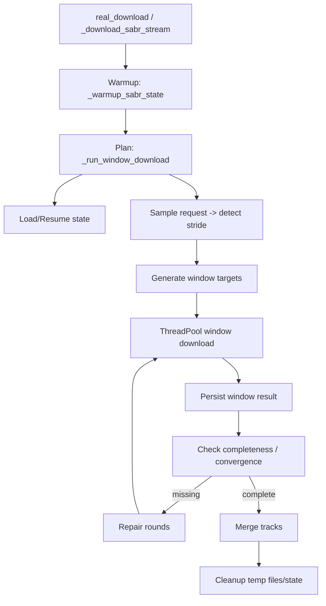
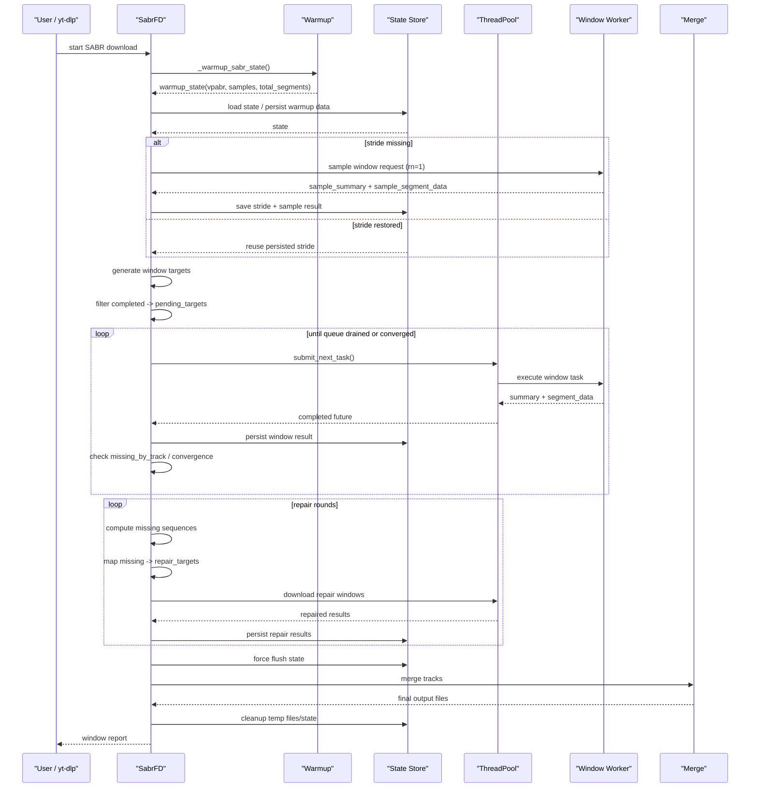
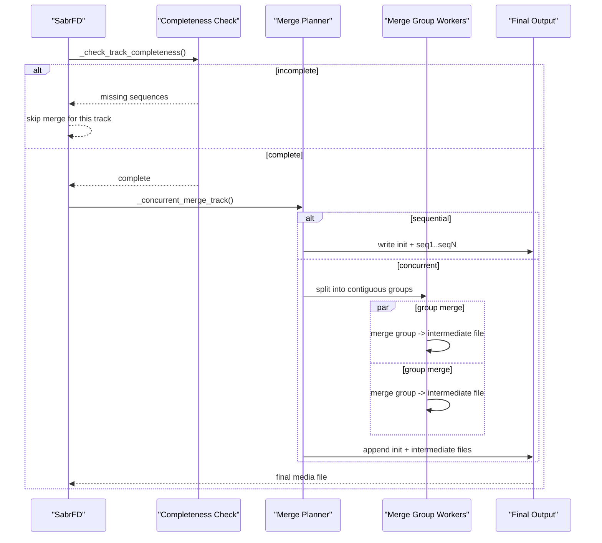

# Custom SABR Concurrent Downloader

本文档说明 [`sabr.py`](./sabr.py) 这个自定义下载器模块的设计、并发下载流程、调度策略、断点续传机制，以及最终合并输出的实现方式。

该模块不是重新实现一套完整的 SABR 协议栈，而是在上游 [`yt_dlp.downloader.sabr._fd.SabrFD`](../../../../yt_dlp/downloader/sabr/_fd.py) 的基础上，增加了一个“面向 VOD 的窗口化并发下载层”。

核心目标有三个：

1. 将原本偏串行的 SABR 拉流过程改造成面向 VOD 的窗口并发请求。
2. 将每个窗口返回的 segment 落盘为中间 part 文件，并支持基于状态文件的恢复。
3. 在保证输出顺序正确的前提下，尽量减少重复请求、重复写盘和无意义的合并开销。

## 1. 模块定位

模块最终导出的类是：

```python
class SabrFD(_SabrConcurrencyMixin, _SabrFD):
    pass
```

其中：

- `_SabrFD` 是上游 `yt_dlp.downloader.sabr._fd.SabrFD`
- `_SabrConcurrencyMixin` 是本模块新增的并发下载扩展层

也就是说：

- 当 `sabr_concurrency.enabled = False` 时，逻辑退回上游 SABR 下载器
- 当 `sabr_concurrency.enabled = True` 时，VOD 走并发窗口下载流程

当前并发版只支持 VOD，不支持 `is_live` / `post_live`。

## 2. 高层架构

整体可以分成 6 层：

1. SABR 协议层
   负责 SABR 请求/响应解析，来自上游 `SabrStream`、`SabrProcessor`、UMP 解码器等。
2. 热身层
   顺序拉取少量 segment，推导 `vpabr`、`player_time`、平均 segment 时长、总 segment 数、初始 init/media 数据。
3. 窗口规划层
   计算窗口大小、窗口步长、目标窗口序列，以及需要修复的窗口。
4. 并发执行层
   用线程池并发发送窗口请求，每个请求返回一个窗口内的一批 segment。
5. 状态与落盘层
   将窗口结果写入 `.part` 文件，并维护 `.json` 状态文件，用于恢复、补洞和统计。
6. 合并层
   校验轨道完整性，将 `init + seqN.part` 按顺序合并成最终输出。

可以用下面的图概括：



## 3. 主入口

并发路径从 `_download_sabr_stream()` 开始。

执行分支如下：

1. 读取 `sabr_concurrency` 配置。
2. 如果未启用并发，直接调用上游 `super()._download_sabr_stream(...)`。
3. 如果是 live / post-live，直接报错退出。
4. 为音频、视频、字幕构造 selector。
5. 选择一个主格式 `primary_format` 作为窗口规划和热身的基准轨道。
6. 先做 `warmup`，再进入 `_run_window_download()`。

这里的关键设计是：

- 网络协议仍然使用上游 SABR/UMP 解析逻辑
- 并发能力不是对 `SabrStream` 做线程化，而是把“窗口请求”当作调度单元

这意味着模块的并发粒度是“请求级窗口并发”，不是“单个 TCP 流内部多线程读写”。

## 4. 数据结构

### 4.1 `SabrWarmupState`

热身结束后，会得到一个 `SabrWarmupState`，其中最重要的字段有：

- `url`
  热身结束后当前可用的 SABR URL
- `vpabr`
  后续窗口请求的模板请求体
- `format_id`
  当前主轨道的格式 ID
- `formats`
  活跃轨道集合，包含输出文件名和 `info_dict`
- `total_segments`
  轨道总 segment 数
- `average_duration_ms`
  平均 segment 时长
- `estimated_origin_ms`
  估算出来的媒体时间原点
- `samples`
  热身样本序列
- `init_segments`
  热身阶段抓到的 init 数据
- `segment_data`
  热身阶段抓到的媒体段数据

### 4.2 `SabrTask`

每个并发窗口请求用一个 `SabrTask` 表示，包含：

- `target_sequence`
  本窗口瞄准的目标序列号
- `rn`
  请求编号
- `payload`
  已序列化的 `VideoPlaybackAbrRequest`
- `request_summary`
  调试和状态记录使用的请求摘要

### 4.3 状态文件

状态文件是一个 JSON 文档，核心部分包括：

- `formats`
  每个轨道的显示名、类型、输出文件名
- `tracks`
  每个轨道已经落盘的 part 文件清单
- `windows`
  每个窗口是否完成、对应写入了哪些轨道文件
- `stride`
  已检测出的窗口大小
- `segment_dir`
  中间 part 文件目录

另外，运行时还有一个不序列化的 `_runtime` 缓存，用于保存：

- `track_stats.downloaded_bytes`
- `track_stats.media_downloaded_bytes`
- `track_stats.sequence_numbers`
- `dirty_ops`
- `last_save_time`

这些缓存的作用是：

- 避免每次 progress / completeness 检查都全量扫描 `tracks`
- 将 state save 改为节流写盘，而不是每次写一个 segment 都重写整份 JSON

## 5. 热身流程

热身是整个并发设计的前提。它的职责不是下载完整内容，而是推导后续并发请求所需的上下文。

### 5.1 热身做什么

`_warmup_sabr_state()` 会：

1. 用正常 SABR 请求方式创建一个 `SabrStream`
2. 顺序消费少量 segment
3. 处理控制类 part
   - `PoTokenStatusSabrPart`
   - `RefreshPlayerResponseSabrPart`
4. 收集：
   - `FormatInitializedSabrPart`
   - `MediaSegmentDataSabrPart`
   - `MediaSegmentEndSabrPart`
5. 根据样本计算：
   - `total_segments`
   - `average_duration_ms`
   - `estimated_origin_ms`
6. 保存热身阶段拿到的 init 段和媒体段

### 5.2 为什么要热身

因为窗口并发请求不是从 0 开始盲猜：

- 要先知道 server 对当前格式的 segment 编号方式
- 要先知道请求模板 `vpabr`
- 要先知道大概的媒体时间到 segment 序号的映射
- 要先知道窗口大小 `stride` 如何探测

简单说，热身是在“建立后续并发请求的坐标系”。

## 6. 窗口调度总流程

`_run_window_download()` 是整个并发下载的总控。

它的核心步骤是：

1. 基于热身结果计算 `safe_window_start`
2. 计算动态起始窗口 `sample_target`
3. 加载或恢复状态文件
4. 持久化热身阶段已经拿到的 init/segment 数据
5. 如果还没有 `stride`，先发一个 sample request 来检测窗口大小
6. 根据 `stride`、`window_overlap_segments` 计算窗口步长
7. 生成所有窗口目标 `targets`
8. 去掉已经完成的窗口，得到 `pending_targets`
9. 并发下载窗口
10. 根据缺失 segment 做 repair rounds
11. 完成后合并轨道
12. 清理中间文件和状态文件

## 7. 调度器设计

### 7.1 起始窗口

热身已经覆盖了前几个 segment，因此第一个并发窗口不能从 1 重新开始。

模块里先算：

- `safe_window_start = warmup.samples[-1].sequence_number + 1`

然后再与配置的 `window_start` 取更合适的位置，交给 `_calculate_dynamic_start()`：

- 优先避免覆盖热身已完成区间
- 如果已知窗口大小，尽量按窗口边界对齐
- 如果接近尾部，避免目标窗口超出 `total_segments`

### 7.2 窗口大小 `stride`

窗口大小不是硬编码的，而是通过 sample request 检测。

检测逻辑：

1. 发送一个指向 `sample_target` 的请求
2. 看返回里主轨道包含多少个从 `target_sequence` 开始的连续序列
3. 如果没有严格从 target 开始的连续序列，则退化到“最大连续段长度”

检测到的 `stride` 会写入状态文件，后续恢复时可直接复用。

### 7.3 主下载窗口步长

窗口大小检测完成后：

- `window_size = stride`
- `window_overlap = min(config.window_overlap_segments, window_size - 1)`
- `window_stride = max(1, window_size - window_overlap)`

也就是说：

- 窗口之间不是完全不重叠
- 会保留少量 overlap
- 这样可以降低补洞难度

设计意图是：

- 主下载阶段尽量减少重复请求
- repair 阶段专门处理缺洞
- 不在主阶段用过密窗口把重复 segment 拉满

### 7.4 目标窗口生成

窗口序列由 `_generate_window_plan()` 生成。

目前支持：

- `sequential`
  线性窗口序列
- `interleaved`
  交错调度
- `adaptive`
  当前实现仍然主要落到交错逻辑

交错调度的意图是：

- 避免多个 worker 总在相邻位置竞争相似数据
- 让并发请求尽量分散在时间轴上
- 减少“局部连续窗口全失败”导致的长洞

例如：

- 线性：`[5, 8, 11, 14, 17, ...]`
- 交错：把目标分组后穿插提交，尽可能拉开相邻任务

## 8. 调度时序图

下面是主下载阶段的调度时序。



## 9. Worker 执行流程

每个窗口 worker 干的事情相对简单：

1. 根据 `target_sequence` 构造一个新的 `vpabr`
2. 发送 HTTP POST 到 SABR URL
3. 解码响应里的 UMP parts
4. 提取出该窗口返回的各个轨道 segment 数据
5. 返回给主线程统一落盘

这里有一个重要设计：

- worker 线程只负责“请求和解析”
- 最终状态更新和写盘在主线程进行

这样做的好处是：

- 不用在多个 worker 之间加复杂锁来保护状态结构
- `tracks/windows` 的一致性更容易保证
- 出问题时主线程更容易做统一的完整性判定

代价是：

- 如果单次落盘过慢，会拖慢 future 消费

为降低这个代价，本模块后续做了两类优化：

1. `task` 惰性构造
2. state / progress 走运行时缓存和节流写盘

## 10. 请求构造

窗口请求由 `_build_window_task()` 构造，核心逻辑是：

1. 复制热身阶段的 `vpabr`
2. 修改当前窗口对应的：
   - `player_time_ms`
   - `buffered_ranges`
3. 将其序列化为 protobuf `payload`

其中：

- `_estimate_player_time_ms()` 用平均 segment 时长估算目标 sequence 对应的媒体时间
- `_make_target_buffered_range()` 用来告诉 server：哪些 segment 已经视为“缓冲完成”

这本质上是在“模拟一个已经顺序缓冲到某个位置的客户端”，从而诱导 GVS 返回目标窗口附近的数据。

## 11. 窗口结果解析

`_decode_window_response()` 会解析：

- `MEDIA_HEADER`
- `MEDIA`
- `FORMAT_INITIALIZATION_METADATA`
- `STREAM_PROTECTION_STATUS`
- `SABR_ERROR`
- `SABR_REDIRECT`
- `RELOAD_PLAYER_RESPONSE`
- `NEXT_REQUEST_POLICY`
- `SABR_CONTEXT_UPDATE`
- `SABR_CONTEXT_SENDING_POLICY`
- `SABR_SEEK`

重点是 `MEDIA` 部分：

- 会按 `format_key -> sequence_key` 收集 segment 数据
- 当前实现使用 `bytearray` 增量拼接，避免 `bytes + bytes` 的重复分配

返回值包括：

- `summary`
  用于日志、统计、repair 分析
- `segment_data`
  按轨道和序列号聚合好的原始数据

## 12. 状态落盘与断点续传

### 12.1 持久化什么

模块会把下面几类数据写入磁盘：

1. `init` 段
   文件名形如：`xxx.init.part`
2. 媒体段
   文件名形如：`xxx.seq123.part`
3. state JSON
   记录窗口完成情况、轨道文件清单、stride 等信息

### 12.2 为什么能恢复

恢复的关键在于：

- `windows[target].status == completed`
  说明这个窗口之前已经成功解析并落盘
- `tracks[label][sequence]`
  说明对应 segment 的文件已经存在
- `stride`
  说明窗口大小已经探测过

恢复时流程是：

1. 读取旧 state
2. 校验 state 是否与当前格式匹配
3. 扫描 `tracks` 中记录的 part 文件是否仍然存在
4. 不存在的 part 会被 prune 掉
5. 已完成窗口但其写入文件不完整时，会退回 `pending`

### 12.3 运行时缓存

运行时 `_runtime.track_stats` 缓存会维护：

- `downloaded_bytes`
- `media_downloaded_bytes`
- `sequence_numbers`

这样：

- progress 不必每次 `sum(track_state.values())`
- completeness 不必每轮都重扫整条 track

### 12.4 写盘节流

`_save_window_state()` 不是每次都写：

- 小于 `state_save_every_ops`
- 且距离上次写盘小于 `state_save_interval_sec`

就会跳过实际落盘，只更新内存态。

这样做的好处：

- 显著减少 JSON 全量重写
- 减少并发窗口下载阶段的磁盘抖动

## 13. 修复策略

主下载阶段结束后，不认为结果一定完整。

`_state_missing_sequences()` 会按轨道计算缺失序列，然后：

- `_repair_targets_for_missing()` 将缺失序列映射回可能需要重拉的窗口

映射策略包含两部分：

1. 基于窗口大小的“原始窗口映射”
2. 缺失序列前后窗口的直接扩展修复

也就是说，对于一个缺失序列，不只是重试它所在窗口，还可能重试：

- 前一个窗口
- 当前窗口
- 后一个窗口

这样可以覆盖“server 返回窗口覆盖不稳定”这种情况。

## 14. 完整性判定

最终合并前，`_check_track_completeness()` 会做轨道完整性检查。

当前主要检查：

1. 序列是否连续
2. 如果有 `total_segments`，是否覆盖 `[1, total_segments]`
3. 如果有 `filesize/filesize_approx`，下载字节必须与预期字节完全相等

设计原则是：

- 缺少 sequence，直接判定不完整，不合并
- 文件大小只要不完全相等，就判定不完整，不强行拼接

这保证了最终输出不会在 segment 明显缺洞时仍然强行拼接。

## 15. 合并设计

### 15.1 顺序合并

顺序合并是最稳定的路径：

1. 打开最终临时输出文件
2. 先写入 init 段
3. 再按 sequence 升序写入各个 `seqN.part`
4. 关闭文件
5. `rename` 到最终文件名

适合：

- 文件数不多
- 总体积不大
- 同盘 I/O，避免中间文件二次拷贝

### 15.2 并发合并

并发合并会：

1. 先把连续 sequence 分成若干连续区间组
2. 每组并发写入一个 intermediate 文件
3. 再按组顺序把 intermediate 文件拼到最终输出

注意：

- 这不是“零拷贝”
- 它会引入一轮中间文件写入和再读取

因此并发合并只有在一定规模下才划算。

### 15.3 为什么现在默认更保守

模块中 `_should_use_concurrent_merge()` 会在以下情况回退到顺序合并：

- 明确禁用并发合并
- 总 segment 数太少
- 总体积太小
- 平均 part 太大

这是因为在普通 SSD / NVMe 上：

- “并发生成中间文件 + 再串行拼最终文件”
  不一定比
- “直接顺序写最终文件”
  更快

当前实现优先保证：

- 合并稳定性
- I/O 放大可控

## 16. 合并时序图



## 17. 调度优化点

当前模块里几个关键优化如下。

### 17.1 惰性 task 构造

早期思路会先把所有窗口的 `SabrTask` 全部构造出来。

当前实现改为：

- 线程池有空位时才构造下一个 task

收益：

- 减少前置的 `deepcopy(vpabr)` 和 `protobug.dumps()`
- 避免大任务量时先吃掉一波 CPU 和内存

### 17.2 `bytearray` 聚合 segment

窗口响应里一个 sequence 可能由多个 `MEDIA` part 组成。

当前实现改为：

- 使用 `bytearray.extend()` 聚合

避免了：

- `bucket[key] = bucket[key] + chunk`
  这种重复分配和复制

### 17.3 运行时统计缓存

完整性检查、缺失检测、progress 不再每次都全量扫描 `tracks`。

收益：

- 大量窗口时 CPU 更稳定
- state 越大，缓存收益越明显

### 17.4 state save 节流

JSON 状态文件不再每写一个窗口就毫无节制地重写。

收益：

- 降低主线程 persist 阶段的抖动
- 恢复能力保留，但更偏向吞吐友好

### 17.5 更保守的 merge 策略

并发合并不再盲目开启，而是根据文件数和总数据量判断。

收益：

- 避免小任务被“中间文件双拷贝”拖慢

## 18. 配置项说明

常用配置如下。

| 配置项 | 作用 | 默认值 |
|---|---|---:|
| `enabled` | 是否启用并发 SABR 下载 | `True` |
| `thread_number` | 窗口并发线程数 | `4` |
| `warmup_segments` | 热身阶段样本 segment 数 | `4` |
| `window_start` | 用户指定的起始窗口 | `1` |
| `window_count` | 窗口数，`None` 表示自动计算 | `None` |
| `repair_rounds` | 修复轮次 | `2` |
| `window_size_verify_attempts` | stride 检测验证次数 | `1` |
| `dynamic_start_enabled` | 是否启用动态起始窗口 | `True` |
| `window_planning_mode` | 窗口规划模式 | `interleaved` |
| `interleaving_enabled` | 是否启用交错调度 | `True` |
| `window_overlap_segments` | 窗口重叠 segment 数 | `1` |
| `state_path` | 状态文件路径 | 自动生成 |
| `segment_dir` | 中间 part 目录 | 自动生成 |
| `state_save_interval_sec` | state 节流时间窗口 | `0.5` |
| `state_save_every_ops` | state 节流操作阈值 | `8` |
| `enable_concurrent_merge` | 是否允许并发合并 | `True` |
| `merge_concurrency` | 显式指定合并并发数 | `None` |
| `merge_copy_buffer_size` | 合并拷贝缓冲区大小 | `1 MiB` |

## 19. 模块的边界与限制

当前实现有这些明确边界：

1. 仅支持 VOD
2. 依赖 `protobug`
3. 仍然建立在上游 SABR 协议层正确工作的前提下
4. 窗口请求本质上仍是“基于 warmup 推导出的近似规划”
   不是 server 明确提供的随机访问 API
5. repair 机制能补很多洞，但不是数学上绝对完备

## 20. 阅读代码的推荐顺序

如果要从代码层面理解模块，推荐按这个顺序看：

1. [`_download_sabr_stream`](./sabr.py)
2. [`_warmup_sabr_state`](./sabr.py)
3. [`_run_window_download`](./sabr.py)
4. [`_download_window_targets`](./sabr.py)
5. [`_persist_window_result`](./sabr.py)
6. [`_state_missing_sequences`](./sabr.py)
7. [`_merge_window_track`](./sabr.py)
8. [`_concurrent_merge_track`](./sabr.py)

这样可以从“入口 -> 调度 -> 状态 -> 合并”一路串下来。

## 21. 总结

这个模块的本质不是“把 SABR 流简单多开几个线程”，而是：

- 先顺序热身
- 再把后续下载抽象成窗口任务
- 用状态文件驱动恢复和补洞
- 最后在轨道级别做完整性校验和合并

因此，它的关键设计点不是单个 API 调用，而是下面这条流水线：

`warmup -> detect stride -> plan windows -> parallel fetch -> persist -> repair -> merge`

如果要继续演进，最值得持续关注的仍然是三块：

1. 窗口规划是否足够稳定
2. state/persist 是否仍然会在大任务下成为瓶颈
3. merge 是否应该根据盘型和文件规模做更细粒度的策略选择
